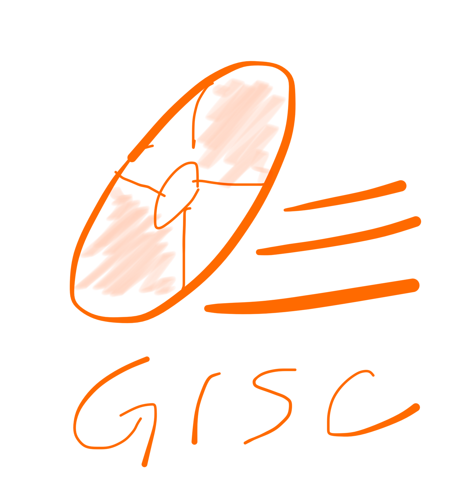

# gisc



A scaffolding tool that uses Git repository.

[](https://travis-ci.org/jinjor/gisc)
[](https://ci.appveyor.com/project/jinjor/gisc)

```console
$ npm install -g gisc
```

## Example

```console
$ gisc get jinjor/gisc example my-project
```

```console
$ gisc add ex jinjor/gisc example
$ gisc ex my-project
```

Run `gisc --help` to see more details.
